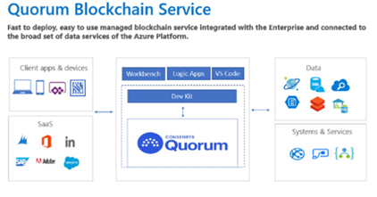
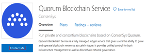

# H1 Quorum Blockchain Service on Azure

Quorum Blockchain Service (QBS) is a managed ledger service from Consensys. It allows organizations to run their own blockchain network for their needs without having to deal with infrastructure management. 

## Features

- QBS leverages Ethereum ledger and Istanbul Byzantine Fault Tolerance (IBFT) Proof-of-Authority (PoA) consensus mechanism
- QBS currently supports GoQuorum ledger protocol
- QBS supports open-source clients and tools such as Truffle, MetaMask, Solidity and Geth
- QBS provides extensions for Visual Studio Code
  - Users can also build and deploy smart contracts to QBS via Visual Studio Code
- QBS provides management APIs and supports monitoring and logging of blockchain nodes with integration to Azure Monitor.  

## Getting Started

QBS comes in multiple tiers – developer, business, and enterprise. For detail comparison visit: [Quorum Blockchain Service | ConsenSys](https://consensys.net/quorum/qbs/) 

QBS is currently only accessible as a Private offering on Azure. You will need to either:
  -	Click “Contact Me” on [Microsoft Azure Marketplace](https://azuremarketplace.microsoft.com/en-us/marketplace/apps/consensys.qbs-contact-me?tab=Overview) 

 

  - Inquire directly with [QBS Support](https://quorum-support.zendesk.com/hc/en-us/restricted?return_to=https%3A%2F%2Fquorum-support.zendesk.com%2Fhc%2Fen-us) 
After confirmation of access from Consensys, you will then be able to add QBS via “Create a Resource” options in Azure Portal. 

## Next steps

- [Create a network - Quorum Blockchain Service](https://docs.qbs.consensys.net/Get-Started/Create-a-Network/)
- [Monitor nodes - Quorum Blockchain Service](https://docs.qbs.consensys.net/HowTo/Metrics/)
- [Create, build, & deploy smart contracts tutorial](https://docs.qbs.consensys.net/Tutorials/Deploy-Smart-Contract/VSCode/)
- [Using MetaMask - Quorum Blockchain Service](https://docs.qbs.consensys.net/HowTo/Connect-to-Network/MetaMask/)
- [Use Geth to attach to Quorum Blockchain Service](https://docs.qbs.consensys.net/HowTo/Connect-to-Network/Geth/)
- [Using Truffle - Quorum Blockchain Service](https://docs.qbs.consensys.net/HowTo/Connect-to-Network/Truffle/)
- [Migrate - Quorum Blockchain Service](https://docs.qbs.consensys.net/Get-Started/Migrate/Migrate/)

## Related resources

- [What is monitored by Azure Monitor?](/azure/azure-monitor/monitor-reference)
